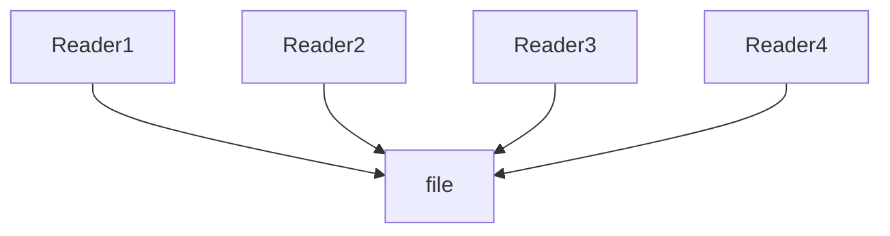
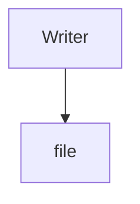

# Intro: 
The readers-writers problem is an specific case take out from the [[Algorithm - Producer-Consumer problem]]. 
When developing for a producer-consumer problem there is no more than two processes, then what happens if there are several processes producing? Or several processes consuming?
This is what happens with readers and writers. 
Readers are those processes consuming  while writers are the one producing. **No reader can read while a writer produces and vice versa**. 
While several readers can read at the same time, **no two writers can write at the same time**. 
We then define the following structure: 


$$
\begin{gather}
OR
\end{gather}
$$


Different variations of the algorithm have been created based on who has priority. We’ll see the two main cases. When readers have priority and when writers have priority.
# Simplest reader-writer problem
The simplest version of this problem goes in the following way: 

```c
\\ All semaphores are initialized in 0
\\ READER
do {
    wait(read)
    ............
    reading data
    ............
    signal(write)
} while (TRUE);
\\ WRITER
do {
    wait(write)
    .............
    writing data
    .............
    signal(read)
} while (TRUE);

```

This solution is based on the following algorithm: 
+ Reader will run after Writer because of read semaphore
+ Writer will stop writing when the write semaphore has reached 0
+ Reader will stop reading when the read semaphore has reached 0
# Solutions and implementations
## 1. **Readers have priority**
If readers have priority, a writer won’t be able to writer up until all readers are out. A reader that has arrived after the writer will still be able to enter and read if more readers are reading. This can cause **starvation** as the writer may never enter. This solution is called **readers-preference**

### Implementation:
```c
semaphore resource=1;
semaphore rmutex=1;
readcount=0;
/*
   resource.P() is equivalent to wait(resource)
   resource.V() is equivalent to signal(resource)
   rmutex.P() is equivalent to wait(rmutex)
   rmutex.V() is equivalent to signal(rmutex)
*/
writer() {
    resource.P();          //Lock the shared file for a writer
    <CRITICAL Section>
    // Writing is done
    <EXIT Section>
    resource.V();          //Release the shared file for use by other readers. Writers are allowed if there are no readers requesting it.
}
reader() {
    rmutex.P();           //Ensure that no other reader can execute the <Entry> section while you are in it
    <CRITICAL Section>
    readcount++;          //Indicate that you are a reader trying to enter the Critical Section
    if (readcount == 1)   //Checks if you are the first reader trying to enter CS
        resource.P();     //If you are the first reader, lock the resource from writers. Resource stays reserved for subsequent readers
    <EXIT CRITICAL Section>
    rmutex.V();           //Release
    // Do the Reading
    rmutex.P();           //Ensure that no other reader can execute the <Exit> section while you are in it
    <CRITICAL Section>
    readcount--;          //Indicate that you no longer need the shared resource. One fewer reader
    if (readcount == 0)   //Checks if you are the last (only) reader who is reading the shared file
        resource.V();     //If you are last reader, then you can unlock the resource. This makes it available to writers.
    <EXIT CRITICAL Section>
    rmutex.V();           //Release
}

```

**Key points:**
+ There can be several readers in the critical section 
+ A writer can only go in if there are no readers inside the process (this can lead to starvation).
+ Once a writer is in, no readers can go in until the writer is out


## 2. **Writers have priority**

To solve the problem of writers starving another solution was proposed. **Writers-preference** solution gives preference to those processes that have arrived earlier. This way if a writer arrives, it’ll only have to wait for the readers that are already inside the file, if any reader arrives after the writer, they will have to wait for the writer to enter. 
### Implementation: 

```c
int readcount, writecount;                   //(initial value = 0)
semaphore rmutex, wmutex, readTry, resource; //(initial value = 1)
//READER
reader() {
<ENTRY Section>
  readTry.P();                 //Indicate a reader is trying to enter
  rmutex.P();                  //lock entry section to avoid race condition with other readers
  readcount++;                 //report yourself as a reader
  if (readcount == 1)          //checks if you are first reader
    resource.P();              //if you are first reader, lock  the resource
  rmutex.V();                  //release entry section for other readers
  readTry.V();                 //indicate you are done trying to access the resource
<CRITICAL Section>
//reading is performed
<EXIT Section>
  rmutex.P();                  //reserve exit section - avoids race condition with readers
  readcount--;                 //indicate you're leaving
  if (readcount == 0)          //checks if you are last reader leaving
    resource.V();              //if last, you must release the locked resource
  rmutex.V();                  //release exit section for other readers
}
//WRITER
writer() {
<ENTRY Section>
  wmutex.P();                  //reserve entry section for writers - avoids race conditions
  writecount++;                //report yourself as a writer entering
  if (writecount == 1)         //checks if you're first writer
    readTry.P();               //if you're first, then you must lock the readers out. Prevent them from trying to enter CS
  wmutex.V();                  //release entry section
  resource.P();                //reserve the resource for yourself - prevents other writers from simultaneously editing the shared resource
<CRITICAL Section>
  //writing is performed
  resource.V();                //release file
<EXIT Section>
  wmutex.P();                  //reserve exit section
  writecount--;                //indicate you're leaving
  if (writecount == 0)         //checks if you're the last writer
    readTry.V();               //if you're last writer, you must unlock the readers. Allows them to try enter CS for reading
  wmutex.V();                  //release exit section
}

```
