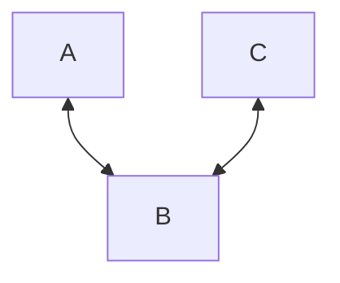
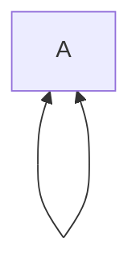

> [!Note] Pseudograph
> A pseudo graph is defined by a nonempty set with all the vertices, a set with all the edges and a function $\gamma$ that defines the edge set as tuples of two vertices that are inside the vertex graph
$$
G = (V, E, \gamma)
$$
$$
\gamma: E\rightarrow \{\{u,v\}: u,v \in V\}
$$

**We'll asume that the graph is undirected, this is why arrows go both sides, else it could be also written as a no arrow connection**

**Multiple edges**: When two edges are connecting the same two vertices: 

**Loops:** For an edge to start and end in the same node: 

## Characteristics: 
+ **Degree:** The degree of valence of a vertex is represented by the number of edges that connect to it
	+ **The loops contribute twice: 1 loop, two degrees**
	+ If degree = 1. Then the vertex is **terminal**
$$
	d(v)
$$

## Types of pseudo-graphs: 
+ [Simple Graph](Simple%20Graph.md): **No multiedges, no loops**
+ [Multigraphs](Multigraphs): **Multiedges okay, no loops**
+ [Regular Graph](Regular%20Graph): **All vertices must have the same degree**
