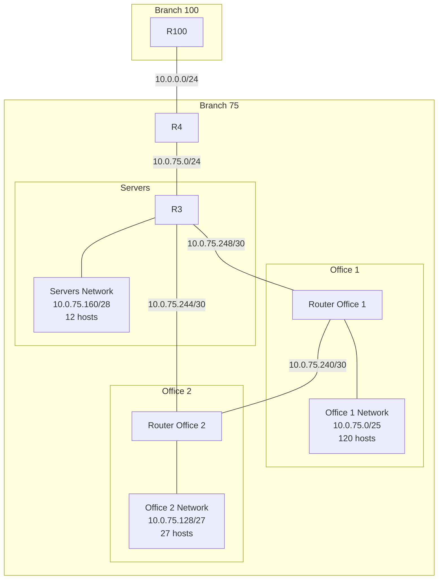

---
aliases:
  - Practica - Routers - 2
tags:
  - Networks
References: 
cssclasses:
---
# Practica - Routers - 2
For this practice we’ll use a **modified version** of the [[1730716899 - Practica - IP addressing|IP Address Assignment]], with small changes to the number of hosts required for each of the networks. 
## Topology design: 

## Requirements: 
1. **Office 1:** 100 hosts
2. **Office 3:** 25 hosts 
3. **Servers:** 10 hosts 
4. Ip addresses must be assigned optimizing the number of direcctions for each network 
### RIP Requirements:
1. RIP should not be used when no adjacent routers use RIP
2. Identify the initial router information
3. The router R100 should be accessible from office networks. 

## Address assignment: 

**Remarks:** 
+ Hosts can be set up in between the router and the broadcast addresses
+ The “zero address”, broadcast and default gateway are taken into account when computing number of hosts. 

#Duda: Why create an independent network for each of the server point-to-point connections. Why not create one network for all servers. 

1. **Office 1:** (Needs 100 hosts, 127 addresses are given using a /25 mask)
	+ Network: 10.0.75.0/25
	+ Router (R1): 10.0.75.1
	+ Broadcast: 10.0.75.127
2. **Office 2:** (Needs 25 hosts, 32 addresses are given using a /27 mask)
	+ Network: 10.0.75.128/27
	+ Router (R2): 10.0.75.129
	+ Broadcast: 10.0.75.159
3. **Servers:** (Needs 10 hosts, 15 addresses are given using a /28 mask ) 
	+ Network: 10.0.75.160/28 
	+ Router (R3): 10.0.75.161 
	+ Broadcast: 10.0.74.175
4. **R1  -  R2**: (Needs 2 hosts and 1 broadcast address. Use a /30 mask)
5. **R2 - R3**: (Needs 2 hosts and 1 broadcast address. Use a /30 mask)
6. **R1 - R3**: (Needs 2 hosts and 1 broadcast address. Use a /30 mask)
7. **R**
## Routing tables: 
Taking the onew from the previous addressing assignment: 
![[1730716899 - Practica - IP addressing#4. Routing Tables]]
***