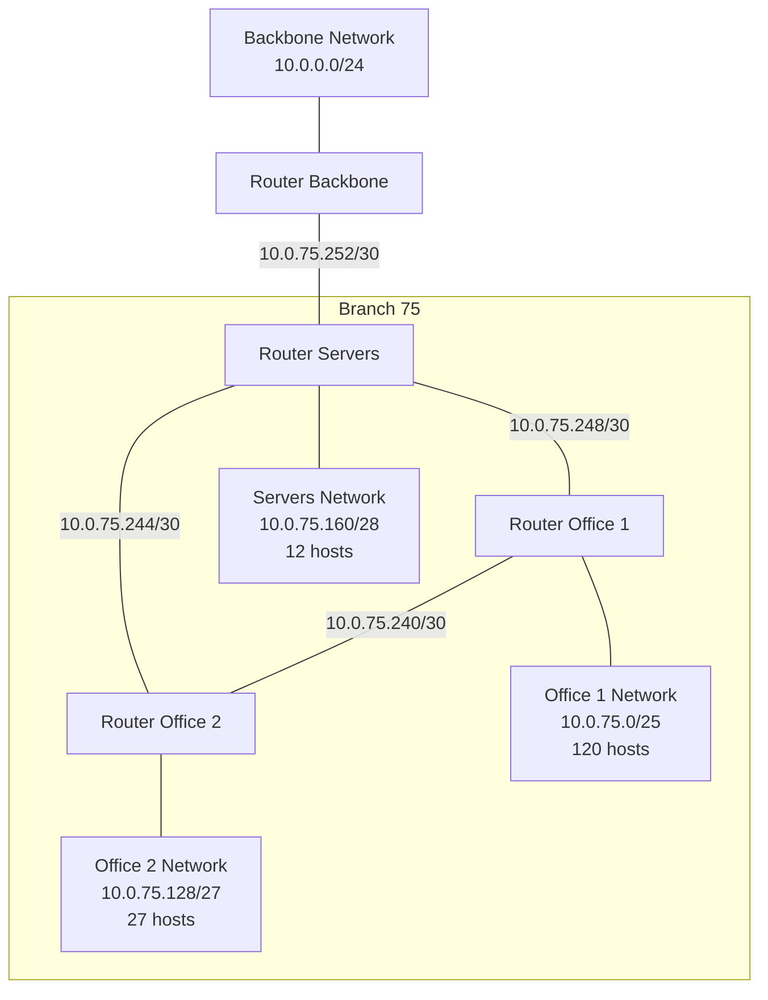

# IP Address Assignment Exercise - Branch 75
## Network Design Documentation

### 1. Network Topology Design

### 2. Network Requirements Analysis

#### 2.1 Global Requirements
- Enterprise network range: 10.0.0.0/16
- Backbone network range: 10.0.0.0/24
- Branch network range: 10.0.75.0/24 (Using 75 as X value)

#### 2.2 Branch Network Requirements
1. Office 1: 120 hosts
2. Office 2: 27 hosts
3. Server Room: 12 hosts
4. Point-to-point connections between:
   - Backbone Router ↔ Server Router
   - Server Router ↔ Office 1 Router
   - Server Router ↔ Office 2 Router
   - Office 1 Router ↔ Office 2 Router

### 3. Network Address Assignment

#### 3.1 LAN Networks (Ordered by size)

1. **Office 1 Network** (Needs 120 hosts)
   - Network: 10.0.75.0/25
   - Usable range: 10.0.75.1 - 10.0.75.126
   - Broadcast: 10.0.75.127
   - Router interface: 10.0.75.1

2. **Office 2 Network** (Needs 27 hosts)
   - Network: 10.0.75.128/27
   - Usable range: 10.0.75.129 - 10.0.75.158
   - Broadcast: 10.0.75.159
   - Router interface: 10.0.75.129

3. **Server Network** (Needs 12 hosts)
   - Network: 10.0.75.160/28
   - Usable range: 10.0.75.161 - 10.0.75.174
   - Broadcast: 10.0.75.175
   - Router interface: 10.0.75.161

#### 3.2 Point-to-Point Networks (/30)

1. **Backbone Router ↔ Server Router**
   - Network: 10.0.75.252/30
   - Backbone Router: 10.0.75.253
   - Server Router: 10.0.75.254

2. **Server Router ↔ Office 1 Router**
   - Network: 10.0.75.248/30
   - Server Router: 10.0.75.249
   - Office 1 Router: 10.0.75.250

3. **Server Router ↔ Office 2 Router**
   - Network: 10.0.75.244/30
   - Server Router: 10.0.75.245
   - Office 2 Router: 10.0.75.246

4. **Office 1 Router ↔ Office 2 Router**
   - Network: 10.0.75.240/30
   - Office 1 Router: 10.0.75.241
   - Office 2 Router: 10.0.75.242

### 4. Routing Tables

#### 4.1 Backbone Router (R_BB)

| Destination Network | Subnet Mask | Next Hop      | Interface    |
|--------------------|-------------|---------------|--------------|
| 10.0.75.0/25      | 255.255.255.128 | 10.0.75.254 | 10.0.75.253 |
| 10.0.75.128/27    | 255.255.255.224 | 10.0.75.254 | 10.0.75.253 |
| 10.0.75.160/28    | 255.255.255.240 | 10.0.75.254 | 10.0.75.253 |

#### 4.2 Server Router (R_S)

| Destination Network | Subnet Mask | Next Hop      | Interface    |
|--------------------|-------------|---------------|--------------|
| 10.0.75.0/25      | 255.255.255.128 | 10.0.75.250 | 10.0.75.249 |
| 10.0.75.128/27    | 255.255.255.224 | 10.0.75.246 | 10.0.75.245 |
| 0.0.0.0/0         | 0.0.0.0     | 10.0.75.253 | 10.0.75.254 |

#### 4.3 Office 1 Router (R_O1)

| Destination Network | Subnet Mask | Next Hop      | Interface    |
|--------------------|-------------|---------------|--------------|
| 10.0.75.128/27    | 255.255.255.224 | 10.0.75.242 | 10.0.75.241 |
| 10.0.75.160/28    | 255.255.255.240 | 10.0.75.249 | 10.0.75.250 |
| 0.0.0.0/0         | 0.0.0.0     | 10.0.75.249 | 10.0.75.250 |

#### 4.4 Office 2 Router (R_O2)

| Destination Network | Subnet Mask | Next Hop      | Interface    |
|--------------------|-------------|---------------|--------------|
| 10.0.75.0/25      | 255.255.255.128 | 10.0.75.241 | 10.0.75.242 |
| 10.0.75.160/28    | 255.255.255.240 | 10.0.75.245 | 10.0.75.246 |
| 0.0.0.0/0         | 0.0.0.0     | 10.0.75.245 | 10.0.75.246 |

### 5. Design Justification

1. **Address Assignment Strategy**
   - Started with largest network (Office 1 - 120 hosts) requiring /25
   - Followed by medium network (Office 2 - 27 hosts) requiring /27
   - Then smallest network (Servers - 12 hosts) requiring /28
   - Point-to-point links assigned /30 networks from remaining address space

2. **Redundancy Features**
   - Redundant physical paths between all offices and server network
   - Multiple routing options in case of link failures
   - Backup routes configured in routing tables

3. **Routing Configuration**
   - Default routes pointed towards backbone for internet access
   - Internal routes configured for optimal path selection
   - Alternative routes available through redundant links

4. **Compliance with Requirements**
   - All networks properly sized for required hosts
   - Maximum 5 LAN interfaces per router not exceeded
   - Separate networks for each unit (Office 1, Office 2, Servers)
   - Point-to-point links between all required routers
   - Redundant paths implemented
   - Addresses assigned from largest to smallest network
